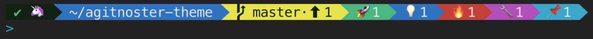

# A(git)noster Theme for Oh My Zsh
Agitnoster theme customizes your zsh prompt to show detailed information about the current git repository status.

This fork is based on the [agitnoster-theme](https://github.com/dbestevez/agitnoster-theme) which is based on [agnoster theme](https://gist.github.com/3712874) included in [Oh My Zsh](https://github.com/robbyrussell/oh-my-zsh) and [bash-git-prompt](https://github.com/magicmonty/bash-git-prompt).



Your "user" section will be a random emoji in this set:
("🍻" "🦄" "🎉" "🤖" "🦖" "🌎" "🌶" "🎮")

Plus you get emoji for git status:
 * 🚀 - staged changes
 * 💡 - untracked files
 * 🔥 - deleted files
 * 🔧 - changed files
 * 📌 - stashed changes
 * 🌋 - file conflicts

## Install
Run the following commands to install agitnoster theme:
```
git clone https://github.com/dbestevez/agitnoster-theme.git
cd agitnoster-theme
./install.sh
```


## Compatibility
Agitnoster theme requires an unicode-compatible font to show git status properly.

To check if your terminal and font support all required characters run the following command:

```
echo "\n\uE0B0 \uB1 \uE0A0 \u27A6 \u2714 \u2718 \u26A1 \u2699 \u2B06 \u2B07\n"
```

The result should look like this:


It is recommended to check the [Powerline fonts](https://github.com/powerline/fonts) project. It includes some patched fonts that are fully compatible with agitnoster theme.
